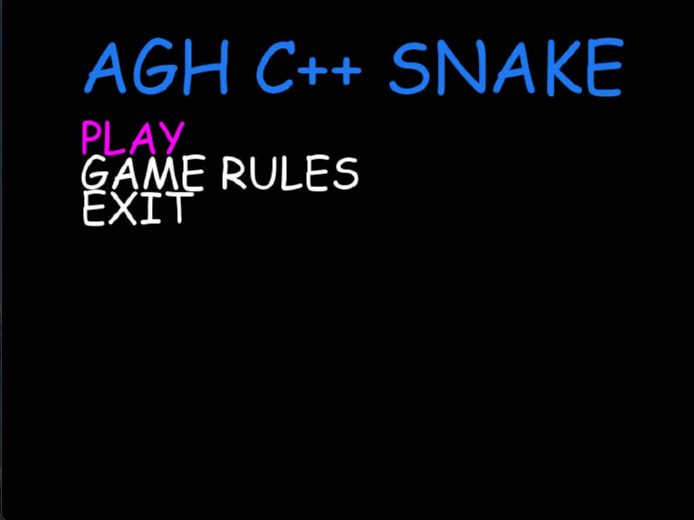
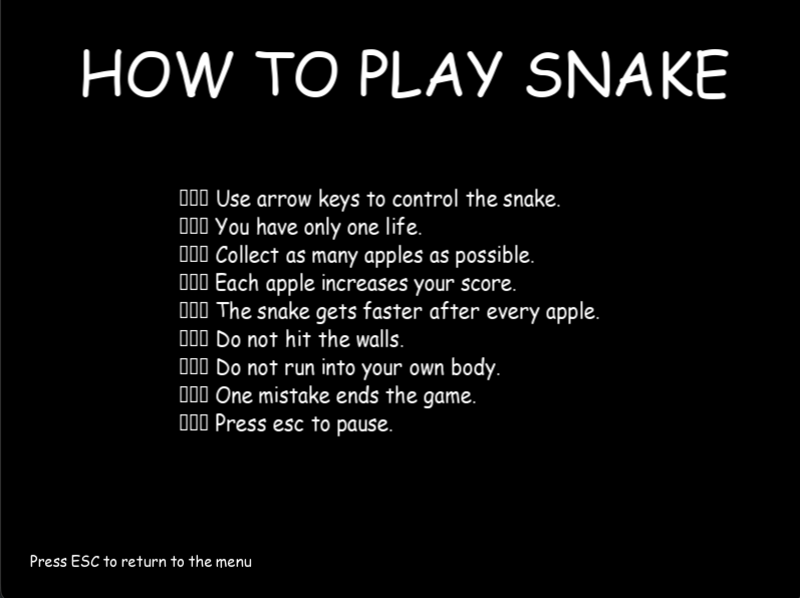
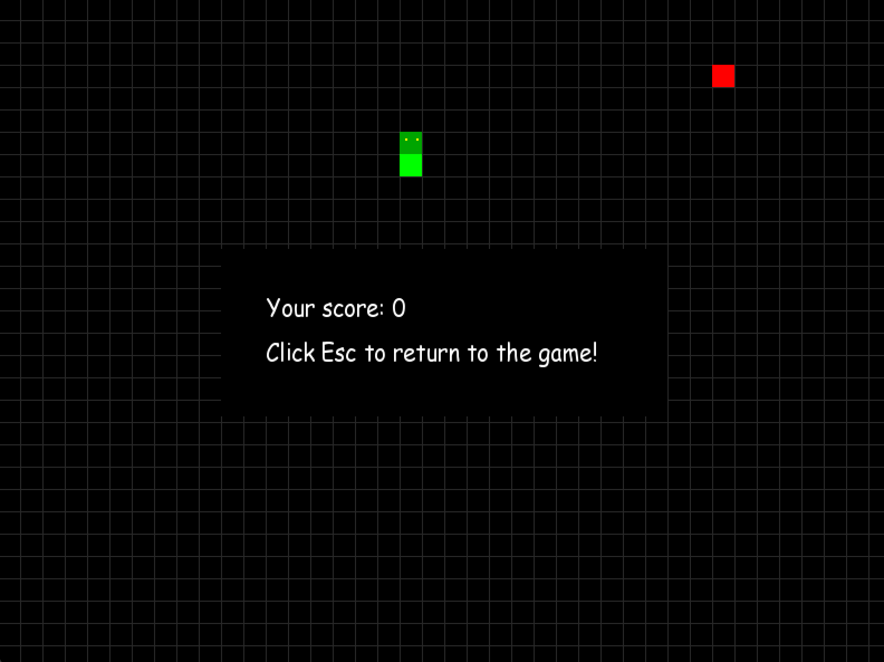
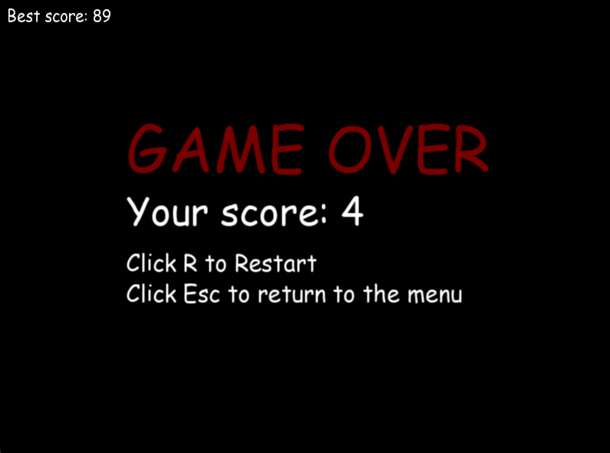
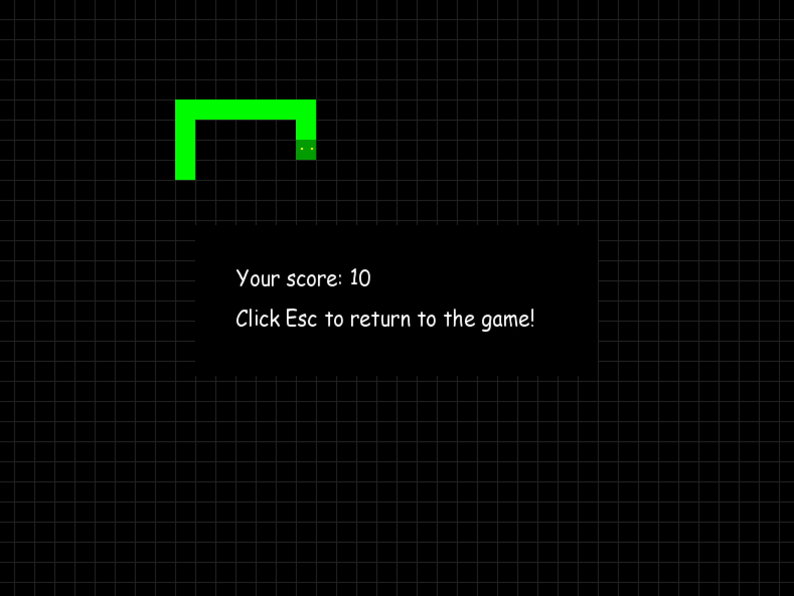

# Snake — C++ University Project

A simple implementation of the classic Snake game created as a university project for learning the basics of programming in C++.

## About

The project focuses on fundamental programming concepts such as object-oriented design, game loop logic, event handling, collision detection and basic file operations.

The game was implemented in C++ using the SFML library.

---

## Features

- Classic Snake gameplay
- Grid-based movement
- Apple spawning system
- Score counting
- Best score saving
- Main menu
- Pause screen
- Game over screen
- Collision detection with walls and snake body

---

## Technologies

- C++
- SFML
- CMake

---

## Project Structure

```text
Snake-Cplusplus-University-Project/
├── assets/
│   ├── data/
│   └── fonts/
│
├── include/
│   ├── Apple.h
│   ├── Snake.h
│   ├── Game.h
│   └── ...
│
├── src/
│   ├── Apple.cpp
│   ├── Snake.cpp
│   ├── Game.cpp
│   └── main.cpp
│
├── screenshots/
│
├── .gitignore
├── CMakeLists.txt
└── README.md
```

---

## Controls

| Key | Action |
|---|---|
| ↑ | Move up |
| ↓ | Move down |
| ← | Move left |
| → | Move right |
| Enter | Select menu option |
| Esc | Pause / return to game |

---

## Build and Run

### Requirements

Make sure you have installed:

- C++ compiler
- CMake
- SFML

### Build

```bash
git clone https://github.com/jpol1/Snake-Cplusplus-University-Project.git

cd Snake-Cplusplus-University-Project

mkdir build
cd build

cmake ..
make
```

### Run

```bash
./SnakeSFML
```

> The executable name may depend on the name defined in `CMakeLists.txt`.

---

## Screenshots

### Main Menu

<p align="center">
  
</p>

### How to play

<p align="center">
  
</p>

### Pause

<p align="center">
  
</p>

### Game Over

<p align="center">
  
</p>

### Gameplay

<p align="center">
  
</p>

---

## Learning Goals

This project was created to practise:

- basic C++ syntax,
- classes and objects,
- project structure with header and source files,
- using external libraries,
- rendering with SFML,
- keyboard event handling,
- simple game state management,
- reading and writing data to files.

---

## Possible Future Improvements

- Add sound effects
- Add difficulty levels
- Add more visual effects
- Improve menu design
---

## Author

Jakub Połeć

AGH University of Science and Technology  
Computer Science and Intelligent Systems
